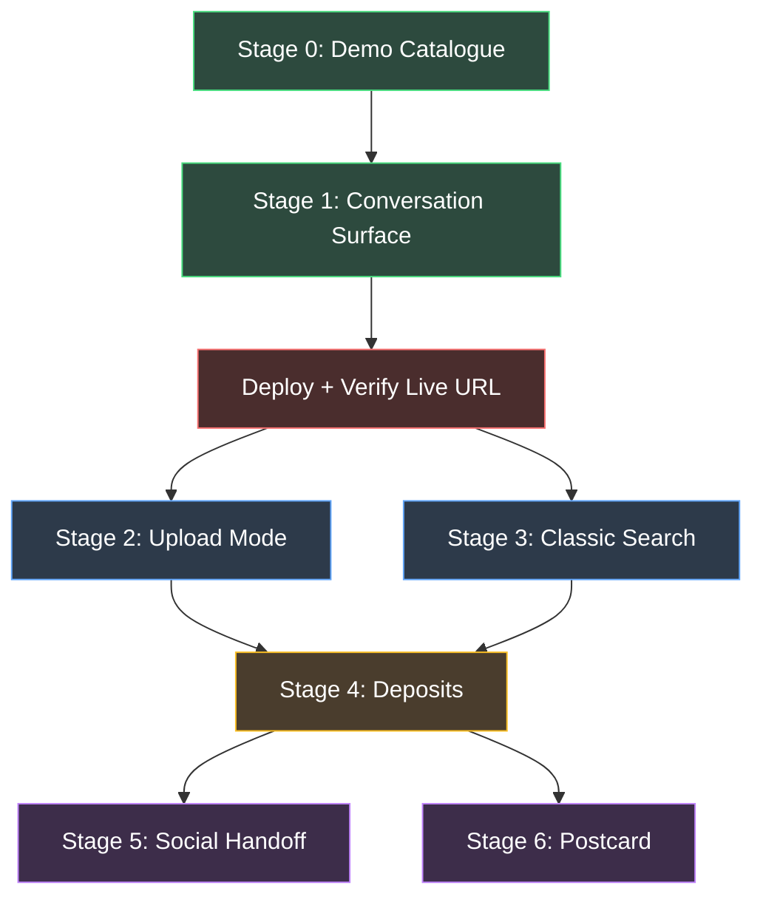

# Implementation Plan — *The One Where*

> Corrections dated 2026-10-04 supersede `ProblemStatement.md` where they conflict. See `docs/corrections.md`, `docs/corrections-2-gemini.md`, `docs/corrections-4-comparison.md`, `docs/corrections-5-scratch.md`, and `docs/corrections-6-navigation.md`.


> Derived from [ProblemStatement.md](file:///d:/Google%20Photos/docs/ProblemStatement.md) and [context.md](file:///d:/Google%20Photos/docs/context.md). Every task below is concrete: it names the file to create or change, what goes in it, what to test, and what must be true before moving on.

---

## Project file tree (target state)

```
/
├── index.html                  # Stage 1 — conversation surface + Stage 3 search toggle
├── deposits.html               # Stage 4 — deposits viewer
├── passiton.html               # Stage 5 — social handoff simulation
├── scratch.html                # Stage 6 — scratch card
├── css/
│   └── style.css               # Shared stylesheet, all pages
├── js/
│   ├── app.js                  # Main controller: routing, mode switching, state
│   ├── catalogue.js            # Catalogue loading (demo JSON vs. localStorage user lib)
│   ├── render.js               # Message + candidate rendering + cluster enforcement
│   ├── voice.js                # Web Speech API module
│   ├── search.js               # Classic search (Stage 3)
│   ├── deposits.js             # Deposit capture + deposit page logic (Stage 4)
│   ├── upload.js               # Upload flow: EXIF, downscale, IndexedDB, batching (Stage 2)
│   ├── idb.js                  # IndexedDB wrapper (open, put, get, delete, clear)
│   ├── passiton.js             # Social handoff logic (Stage 5)
│   └── scratch.js              # Scratch card logic (Stage 6)
├── api/
│   ├── converse.js             # Vercel function — conversation engine (gemini-3.8-flash)
│   └── describe.js             # Vercel function — image describer (gemini-3.1-flash-lite / claude-haiku)
├── data/
│   └── catalogue.json          # Demo library records (exactly 45 entries)
├── images/                     # Demo library images (JPEG, 1200px longest edge)
├── docs/
│   ├── ProblemStatement.md     # Original spec (do not modify)
│   ├── context.md              # Distilled reference
│   ├── implementation-plan.md  # This file
│   └── build_notes.md          # Running log: what's built, deployed, stubbed, decisions
├── vercel.json                 # Vercel config (rewrites, functions, headers)
└── package.json                # Minimal — only @anthropic-ai/sdk as dependency for api/
```

---

## Stage 0 — Demo Catalogue

> **Goal:** Create `data/catalogue.json` with exactly 45 records and matching images in `images/`. Everything downstream depends on this.

### Task 0.1 — Define the record schema and write `data/catalogue.json`

**File:** `data/catalogue.json`

Write all records as a flat JSON array. Each record follows the canonical shape defined in the spec.

**Records to create (in this order):**

| Group | Cluster | Count | `kind` | `near_identical` | Key constraints |
|-------|---------|-------|--------|------------------|----------------|
| Hampi café | `c_hampi_cafe` | 5 | `photo` | `true` | Same café, same morning. 3 records describe blue plastic chairs, 2 describe green. Each `scene` is honest about the colour in its frame. Differences: chair colour, who is in shot, coffee glass full/empty. |
| Laughing woman | `c_laughing` | 6 | `photo` | `true` | Same woman, same table, same minute. Exactly 1 has eyes almost closed + hair across face. `visible_only_on_close_look` notes eye state for each. |
| Receipts | `c_receipts` | 4 | `receipt` | `true` | Same provider, same amount, years 2021–2024. Each record's `scene` says "receipt" — the year is only in `visible_only_on_close_look`. |
| Group trek | `c_trek` | 8 | `photo` | **`false`** | 3 named people (`Dev`, `Priya`, `Amit`), spread across one day. Different trail moments. **Not near-identical** — the eight are obviously different from each other. |
| Standalone | `null` | 22 | mixed | `false` | 5–6 must be non-`photo`. Include: food (3), city streets (3), family at home (4), screenshots/documents (5–6), a wedding (2), a train journey (2), pets (2), accidental shots (1–2). Dates span 2018–2026. Reuse names: `Dev`, `Priya`, `Amit`, `Kavya`, `Rohan`, `Amma`, `Nani`, `Ishaan`. |

**Field checklist per record:**
- [ ] `id` follows `p_NNNN` pattern, unique
- [ ] `file` is `images/<id>.jpg`
- [ ] `taken_at` is ISO 8601 with timezone; some records have `null` (no date known)
- [ ] `place` has `name` and `area`, or is `null`
- [ ] `people` is an array of names, or `[]`
- [ ] `kind` is one of `photo`, `screenshot`, `document`, `receipt`, `video_thumb`
- [ ] `scene` is one sentence, neutral, matches the image
- [ ] `visible_only_on_close_look` has 1–3 items
- [ ] `cluster` is the shared string or `null`
- [ ] `near_identical` is `true` for near-identical clusters (`c_hampi_cafe`, `c_laughing`, `c_receipts`), `false` for `c_trek` and all standalone records
- [ ] `opened_since_capture` is `false` on ~half, `true` on rest
- [ ] `user_deposits` is `[]`

**Validation before done:**
1. Count records — must be exactly 45.
2. Count non-`photo` records — must be ≥9 (~20%).
3. Verify cluster sizes: `c_hampi_cafe`=5, `c_laughing`=6, `c_receipts`=4, `c_trek`=8.
4. Verify 3 blue + 2 green in `c_hampi_cafe` scenes.
5. Verify exactly 1 "eyes closed" in `c_laughing`.
6. Verify receipt years are 2021, 2022, 2023, 2024.
7. Verify `c_trek` uses exactly 3 distinct names across its 8 records.
8. Verify every record in a cluster shares the same `near_identical` value as the rest of its cluster.
9. Verify `near_identical` is `true` for `c_hampi_cafe`, `c_laughing`, `c_receipts` and `false` for `c_trek` and all standalone records.

### Task 0.2 — Source and prepare images

**Directory:** `images/`

1. Search Unsplash/Pexels for multi-shot series matching each cluster.
2. For standalone records, source individual images matching each `scene`.
3. Resize every image: longest edge → 1200px, save as JPEG, filename = `<id>.jpg`.
4. For clusters where a true series can't be found, generate variants from a single source (crop, brightness, flip).
5. **Fallback:** if image sourcing stalls >45 minutes, create solid-colour placeholder JPEGs with the record id drawn on them. Move to Stage 1. Come back.

**Validation before done:**
1. Every record's `file` resolves to an existing image.
2. Open 10 random records and confirm `scene` describes the actual image.
3. Cluster images look plausibly similar at thumbnail size.

### Task 0.3 — Create `docs/build_notes.md`

**File:** `docs/build_notes.md`

Initial content:
- Date started
- Catalogue record count (actual, target: 45)
- Non-photo count (actual, target: ≥9)
- Images: real vs. placeholder count
- Pinned `@google/genai` version (and `@anthropic-ai/sdk` if used)
- Gemini model IDs and measured rate limits (RPM, TPM, RPD)
- Any ambiguous decisions made

---

## Stage 1 — Conversation Surface (Core)

> **Goal:** A user can type or speak a vague memory and get a sensible shortlist back. Deploy to Vercel and confirm.

### Task 1.1 — Shared stylesheet

**File:** `css/style.css`

Design system covering:
- CSS custom properties (colours, spacing, font sizes, border-radius)
- Base reset + body typography (use a clean sans-serif, e.g., system font stack)
- Message thread layout: single column, max-width ~640px, centred
- User message bubble (right-aligned, tinted)
- Assistant message bubble (left-aligned, neutral)
- Thumbnail grid: CSS Grid, auto-fill, ~120px thumbnails
- Full-width photo overlay (modal pattern)
- Input row: text field + mic button + send button, fixed to bottom
- "Cannot distinguish" warning band: distinctive background, above the grid
- Mode switches (for Stage 2 + 3 toggles — add the CSS now, activate later)
- Responsive: works on mobile widths ≥ 360px
- Loading/typing indicator (animated dots or pulse)

### Task 1.2 — IndexedDB wrapper module

**File:** `js/idb.js`

Exports:
- `openDB()` → returns a promise for the database handle
- `putBlob(id, blob)` → stores an image blob
- `getBlob(id)` → retrieves a blob by record id
- `deleteBlob(id)` → removes a single blob
- `clearAll()` → deletes the entire object store
- Database name: `tow_images`, object store: `blobs`, keyPath: `id`

This is needed now because demo images could be served as static files, but user uploads (Stage 2) require IndexedDB. Building the wrapper early avoids refactoring.

### Task 1.3 — Catalogue loader module

**File:** `js/catalogue.js`

Exports:
- `loadCatalogue(mode)` → returns the record array
  - If `mode === 'demo'`: fetch `data/catalogue.json`, merge any `user_deposits` from `localStorage` key `tow_demo_deposits`
  - If `mode === 'user'`: read records from `localStorage` key `tow_user_catalogue`, merge deposits from `tow_user_deposits`. **On load, read every blob from IndexedDB once and build an in-memory `Map<id, objectURL>`.**
- `saveCatalogue(mode, records)` → writes to appropriate localStorage key
- `getMode()` → reads current mode from `localStorage` key `tow_mode` (default: `'demo'`)
- `setMode(mode)` → writes mode
- `getImageURL(id)` → returns `images/<id>.jpg` in demo mode, or the object URL from the in-memory map in user mode. **This is the single image source accessor. `render.js` calls this and never branches on mode.**
- `releaseImageURLs()` → calls `URL.revokeObjectURL` on every entry in the map and clears it. **Must be called on mode switch and after "Delete everything".** Without this, long test sessions will leak memory steadily.

**Key rule:** The catalogue sent to the API must **never** include the `file` field — strip it before sending.

### Task 1.4 — Voice input module

**File:** `js/voice.js`

Exports:
- `initVoice(textField)` → sets up SpeechRecognition, returns `{ start, stop, isSupported }`
- On start: `continuous = true`, `interimResults = true`, `lang = 'en-IN'`
- On `onresult`: pipe transcript into `textField.value` (live, as spoken)
- On silence (3 seconds with no new result): auto-stop
- On second tap: manual stop
- **Never auto-send.** The text field is editable after recognition stops.
- If `SpeechRecognition` is not available: `isSupported = false`. Caller hides mic button.

### Task 1.5 — Conversation API endpoint

**File:** `api/converse.js`

Vercel serverless function. Handles POST requests.

**Input:** `{ mode, messages, catalogue }`
- `mode` is `"hunt"` (default) or `"ask_friend"`. Selects between two system prompts held **server-side**. The client sends only the mode string — it never controls prompt text.
- `messages` is the conversation history: `[{ role: 'user' | 'assistant', content: '...' }, ...]`
- `catalogue` is the record array (no `file` field)

**Logic:**
1. Read `process.env.GEMINI_API_KEY`.
2. Select the system prompt based on `mode`:
   - `"hunt"`: the full hunt prompt from the spec (all 10 rules + output format returning `{ say, candidates, cannot_distinguish, co_present }`).
   - `"ask_friend"`: the ask-friend prompt (see below), returning `{ question, options, why }`.
3. Build the payload for the API call:
   - Map `messages` array roles to `user` and `model` (from `assistant`).
   - Pass the system prompt + catalogue JSON as `systemInstruction`.
4. Call `gemini-3.8-flash` via the `@google/genai` SDK with `temperature: 0`.
5. Use structured output (`responseMimeType: "application/json"` and `responseSchema`) with the appropriate schema based on `mode`.
6. Return the parsed JSON response.

**Hunt response schema:**
```js
const huntSchema = {
  type: "object",
  properties: {
    say: { type: "string" },
    candidates: { type: "array", items: { type: "string" } },
    cannot_distinguish: { type: "boolean" },
    co_present: { type: "array", items: { type: "string" } }
  },
  required: ["say", "candidates", "cannot_distinguish", "co_present"]
};
```

**Ask-friend response schema:**
```js
const askFriendSchema = {
  type: "object",
  properties: {
    question: { type: "string" },
    options: { type: "array", items: { type: "string" } },
    why: { type: "string" }
  },
  required: ["question", "options", "why"]
};
```

**The `ask_friend` system prompt (verbatim):**

```
Someone is trying to find a photo and has got stuck. A second person, who was
present when the photo was taken, is now being asked for help.

You are given the candidate records and the conversation so far.

Write ONE question for that second person. It must be:
- answerable in a few words, without them seeing the full photo
- about something the second person would know and the first person would not
- a question whose answer would change which candidate ranks highest

Do not ask them to describe the photo. Do not ask more than one question.

Return JSON only:
{
  "question": "<the question>",
  "options": ["<short answer>", "<short answer>", "<short answer>"],
  "why": "<one short line: what this would tell us>"
}

Give 2 or 3 options. They must be mutually exclusive, and each must point to a
different candidate.
```

**Error handling:**
- If the API key is missing: return 500 with `{ error: "API key not configured" }`.
- If the Gemini API errors: return 502 with `{ error: "<actual error message>" }`. Never swallow errors.

**Security:**
- Never echo the API key.
- Never include `file` paths in the response.
- CORS: allow only the deployed origin (or `*` for MVP).

### Task 1.6 — Renderer module (with cluster enforcement)

**File:** `js/render.js`

Exports:
- `renderAssistantMessage(response, catalogue)` → creates and appends the assistant message bubble + candidate grid to the message thread

**Cluster enforcement (TWO MECHANISMS):**

**Mechanism A — structural, in code, cannot be overridden:**
```
After receiving candidates from the API, before rendering:

1. For each distinct non-null cluster appearing among the returned candidates:
2.   If 2 or more returned candidates belong to that cluster
     AND that cluster's records have near_identical === true:
3.     Add every catalogue record in that cluster to the render list,
       inserted at the rank of its highest-ranked existing member.
4.     Mark that cluster as expanded.
5. Render the resulting list as the thumbnail grid.
```

This guarantees the user is never shown one member of a near-identical set while the others are hidden.

**Mechanism B — judgement, from the model:**

The model sets `cannot_distinguish` in its own response. **Code must never set, override, or infer this flag.**

**Two bands, not one:**
- A cluster was expanded by Mechanism A → render an informational band above those thumbnails: **"All from the same moment."**
- The model returned `cannot_distinguish: true` → render the stronger band above the grid: **"I can't tell these apart from what I have."**

Both may appear at once. Style them differently — the first is neutral information, the second is the system admitting a limit.

**No-results state:**
- When `candidates` is empty: render the model's `say` and no grid.
- If `say` is also empty, use: *"I haven't found anything yet. Tell me something else you remember — anything at all, even if you're not sure about it."*

**Unknown candidate ids:**
- Candidate ids with no matching record in the catalogue are **skipped silently** in the UI.
- The count of skipped ids is logged to the console. Never render a broken image.

**Rendering rules:**
- Candidate thumbnails in a CSS Grid, directly beneath the assistant's message.
- Each thumbnail is tappable → opens the photo full-width in a modal overlay.
- Modal shows: full image, date (as a time anchor where possible), place, people.
- Modal has a **"That's it"** button (needed for Stage 4 — wire the UI now, attach handler in Stage 4).

**Image source resolution:**
- Use `getImageURL(id)` from `js/catalogue.js`. This returns the correct URL for both demo mode (static path) and user mode (object URL from pre-loaded map). **`render.js` never branches on mode.**

### Task 1.7 — Main application controller

**File:** `js/app.js`

Orchestrates everything:
1. On page load:
   - Determine current mode (`demo` or `user`).
   - Load the catalogue.
   - Initialize voice input (or hide mic if unsupported).
   - Set up the input row event listeners (send button, Enter key, mic toggle).
2. On user sends a message:
   - Append user message to the thread (render immediately).
   - Show a loading indicator.
   - Send `{ mode: "hunt", messages, catalogue }` to `api/converse.js` (catalogue stripped of `file` fields).
   - On response: pass to `render.js`, append to thread.
   - Push to `messages` history array for next turn.
3. Manage conversation state:
   - `messages` array (in memory, not persisted — a new page load = new hunt).
   - Track the current hunt's user messages (needed for Stage 4 deposit capture).

### Task 1.8 — Main HTML page

**File:** `index.html`

Structure:
```html
<!DOCTYPE html>
<html lang="en">
<head>
  <meta charset="UTF-8">
  <meta name="viewport" content="width=device-width, initial-scale=1.0">
  <title>The One Where</title>
  <link rel="stylesheet" href="css/style.css">
</head>
<body>
  <header>
    <!-- Mode switch: Demo library / Your photos (Stage 2 — hidden initially) -->
    <!-- Search toggle: Conversation / Classic search (Stage 3 — hidden initially) -->
  </header>
  <main id="thread">
    <!-- Message bubbles appended here -->
  </main>
  <footer id="input-row">
    <input type="text" id="user-input" placeholder="What do you remember?">
    <button id="mic-btn" aria-label="Voice input">🎤</button>
    <button id="send-btn" aria-label="Send">→</button>
  </footer>
  <!-- Photo modal overlay (hidden by default) -->
  <div id="photo-modal" class="modal hidden">
    
    <div id="modal-info"></div>
    <button id="modal-thats-it">That's it</button>
    <button id="modal-close">✕</button>
  </div>

  <script type="module" src="js/app.js"></script>
</body>
</html>
```

### Task 1.9 — Vercel configuration

**File:** `vercel.json`

```json
{
  "functions": {
    "api/*.js": {
      "memory": 256,
      "maxDuration": 30
    }
  }
}
```

**File:** `package.json`

```json
{
  "name": "the-one-where",
  "private": true,
  "dependencies": {
    "@google/genai": "<pin to exact version that currently resolves>"
  }
}
```

Run `npm install` to generate `package-lock.json`. Record the pinned SDK version in `docs/build_notes.md`.

> **Why pin?** An unpinned dependency changing under you mid-build is not a risk worth carrying.

### Task 1.10 — Deploy and validate

1. `vercel deploy` (or link to Vercel dashboard and push).
2. Set `GEMINI_API_KEY` in Vercel environment variables.
3. Open the public URL in a fresh browser (incognito, no cache).
4. **Test sequence:**
   - Type "that photo from the café in Hampi" → expect shortlist including `c_hampi_cafe` cluster, with "cannot distinguish" band.
   - Type "the receipt from 2023" → expect all 4 receipts shown with "cannot distinguish" band.
   - Type "the one where she's laughing and her eyes are closed" → expect `c_laughing` cluster shown.
   - Test voice input (if browser supports it): tap mic, speak, see transcript, edit, send.
   - Tap a thumbnail → modal opens with image, date, place, people.
5. Record the live URL in `docs/build_notes.md`.

**Exit criteria:** A vague memory typed or spoken returns a sensible shortlist. Cluster enforcement visibly works. The public URL loads in a fresh browser.

---

## Stage 2 — Upload Mode ("Your Photos")

> **Goal:** A user can upload 30–50 of their own photos, have them auto-described, and then search them with the same conversation engine.

### Task 2.1 — Mode switch UI

**Files:** `index.html`, `css/style.css`, `js/app.js`

- Add the **Demo library / Your photos** toggle to the header.
- Store mode in `localStorage` key `tow_mode`.
- Switching mode:
  - **Call `releaseImageURLs()`** before switching (prevents object URL memory leak).
  - Reloads the catalogue via `js/catalogue.js` (which will pre-load user blobs into the object URL map if switching to user mode).
  - Clears the current conversation thread.
  - If switching to "Your photos" for the first time and no user catalogue exists → show the consent screen.

### Task 2.2 — Consent screen

**File:** `index.html` (inline section, hidden by default)

Exact copy from the spec:

> **Your photos stay yours.**
>
> Pick 30 to 50 photos. They stay on this device — they are never saved to any server.
>
> Each photo is sent once to an AI so it can be described in words, and is not stored after that. Only the written descriptions are kept, here in your browser.
>
> Please don't pick anything you'd rather not share. You can delete everything at any time with the button below.

Below it:
- **Choose photos** button → triggers file input
- **Delete everything** button → calls `clearAll()` on IndexedDB + removes `tow_user_catalogue` and `tow_user_deposits` from localStorage

### Task 2.3 — Upload and ingest module

**File:** `js/upload.js`

Exports:
- `handleUpload(files)` → orchestrates the full ingest pipeline

**Pipeline:**

1. **Validate count:** Accept 10–60 files. If >60, warn and process first 60.
2. **For each file:**
   a. Read EXIF using `exifr` (loaded from CDN: `https://cdn.jsdelivr.net/npm/exifr/dist/lite.esm.js`).
   b. Extract `DateTimeOriginal`. Fallback: `file.lastModified`. If both missing: `taken_at = null`.
   c. Downscale: draw to a `<canvas>`, longest edge → 768px, export as JPEG quality 0.7.
   d. Store the downscaled blob in IndexedDB via `js/idb.js` with key = generated id (`up_NNNN`).
   e. Build a partial record: `{ id, file: null, taken_at, place: null, people: [], kind: null, scene: null, visible_only_on_close_look: [], cluster: null, near_identical: false, opened_since_capture: null, user_deposits: [] }`.
3. **Batch describe:** Send to `api/describe.js` in batches of 5.
   - Convert each blob to base64 for the API call.
   - On success: fill in `kind`, `scene`, `visible_only_on_close_look` from the response.
   - On failure per image: set `describe_failed: true`, leave `scene` empty, continue.
4. **Progress UI:** Show *"Describing 23 of 40…"* — update after each batch.
5. **Time-based clustering:** After all descriptions:
   - Sort records by `taken_at`.
   - Any consecutive run of 2+ photos within **60 seconds** → assign shared `cluster` id (`uc_NNNN`). Records placed in a time-based cluster get `near_identical: true`.
   - Records with `null` `taken_at` → `cluster: null`, `near_identical: false`.
6. **WhatsApp warning:** If >50% of files have `taken_at === null`, show: *"Most of these photos have no date — they were probably shared through a messaging app. Copying them from your phone or Google Photos keeps the dates."*
7. **`exifr` fallback:** If `DateTimeOriginal` comes back undefined for more than about a third of files that are plainly camera JPEGs, the lite build is the cause, not the files. In that case, switch the import to the full `exifr` build (`https://cdn.jsdelivr.net/npm/exifr`) before concluding the photos have no EXIF.
8. **Save:** Write the completed catalogue to `localStorage` key `tow_user_catalogue`.
9. **Report:** Show count of successful descriptions, count of failures.

### Task 2.4 — Image description API endpoint

**File:** `api/describe.js`

Vercel serverless function. Handles POST requests.

**Input:** `{ images: [{ id, data: "<base64>" }, ...] }` (batching size determined by rate limit)

**Logic:**
1. The images in a batch are described **concurrently** using `Promise.allSettled`.
2. Each image's call is individually wrapped in try/catch. A failure returns `{ id, error: "<message>" }` for that image only and must not reject the whole batch.
3. **Rate Limits:** Set the batch size and delay between batches based on the measured RPM limit (recorded in `build_notes.md`).
4. **Retries:** Retry on 429 with exponential backoff (2s, 4s, 8s, up to 3 attempts). Honour a `Retry-After` header if present. A 429 that survives all retries is marked distinctly (e.g. `rate_limited: true`) and surfaces: *"Hit the API rate limit. Waiting, then continuing."* Then continue remaining batches.
5. Parse each JSON response (enforced by `describeSchema` structured output): `{ kind, scene, visible_only_on_close_look }`.
6. Return array of results: `[{ id, kind, scene, visible_only_on_close_look }, ...]` (with error entries for failures/rate-limits).
7. Report two separate counts at end of ingest: images failed to describe, and images skipped due to rate limits.

**Describe response schema:**
```js
const describeSchema = {
  type: "object",
  properties: {
    kind: {
      type: "string",
      enum: ["photo", "screenshot", "document", "receipt", "video_thumb"]
    },
    scene: { type: "string" },
    visible_only_on_close_look: { type: "array", items: { type: "string" } }
  },
  required: ["kind", "scene", "visible_only_on_close_look"]
};
```

**Privacy (non-optional):**
- Do not log image data, request bodies, or descriptions.
- Do not write anything to disk.
- Response contains only the JSON described above.

**Error handling:**
- Per-image failure: return `{ id, error: "<message>" }` for that image; do not abort the batch.
- API key missing: return 500.

### Task 2.5 — Delete everything (verify it works)

**Test procedure:**
1. Upload photos, confirm they appear in user catalogue.
2. Tap "Delete everything".
3. Open DevTools → Application → IndexedDB → confirm `tow_images` store is empty.
4. Open DevTools → Application → Local Storage → confirm `tow_user_catalogue` and `tow_user_deposits` are gone.
5. Switch to "Your photos" mode → consent screen appears again.

### Task 2.6 — Deploy and validate

1. Deploy to Vercel.
2. Upload 10–15 test photos (with EXIF dates).
3. Confirm progress indicator works.
4. Confirm descriptions are reasonable.
5. Switch to conversation mode and search for one of the uploaded photos.
6. Test the delete button end-to-end.
7. Test with WhatsApp-forwarded images (no EXIF) — confirm the warning appears.
8. Update `docs/build_notes.md`.

**Exit criteria:** Upload → describe → search works end-to-end on live URL. Delete button fully clears all data.

---

## Stage 3 — Classic Search Toggle

> **Goal:** Add a literal keyword search mode that reproduces the documented failure of traditional search.

### Task 3.1 — Search module

**File:** `js/search.js`

Exports:
- `classicSearch(query, catalogue)` → returns matching records

**Logic:**
1. Lowercase the query, split on whitespace → tokens.
2. For each record, concatenate searchable text: `scene` + `place.name` (if present) + `people` (joined).
3. Lowercase the searchable text.
4. A record matches only if **all** tokens are found in the searchable text.
5. Return matching records.

No LLM call. No synonyms. No fuzzy matching. No stemming.

### Task 3.2 — Toggle UI

**Files:** `index.html`, `js/app.js`

- Add the **Conversation / Classic search** toggle to the header (below the mode switch).
- In Classic search mode:
  - Replace the conversation thread with a simple search results area.
  - Input row becomes a plain search box (no mic button).
  - On submit: run `classicSearch()`, render results as a thumbnail grid.
  - On empty results: show *"0 of `<catalogue size>`. Try the conversation."*

### Task 3.3 — Deploy and validate

1. Deploy.
2. Test searches that **should fail** (these are the genuine failures the research documented):
   - Single-word queries (60% of what real users typed): "trip", "food", "family" → 0 results or wrong results
   - Queries about details in `visible_only_on_close_look` (keyword matching never reads this field): "eyes closed", "empty glass", "2023 receipt" → 0 results
   - "that photo from the trip" → 0 results
   - "the one where Priya looks funny" → 0 results
3. Test searches that **should succeed** (do not weaken Classic search to make the comparison look worse — it must be honest):
   - "blue chairs hampi" → should match some records (because `scene` is a written sentence and contains these words)
   - "laughing" → may match records whose `scene` contains "laughing"
4. Compare with conversation mode for the same queries.
5. Update `docs/build_notes.md`.

> **Note:** Classic search reads `scene`, which is a written sentence, so some literal queries *will* match. That is correct and honest. The genuine failures are single-word queries and queries about fine details that live in `visible_only_on_close_look`.

**Exit criteria:** Classic search demonstrably fails on vague queries. The "0 of N" message appears. The comparison with conversation mode is stark and visible.

---

## Stage 4 — Deposits (Every Search Leaves Something Behind)

> **Goal:** When a user confirms a photo, everything they said becomes a searchable deposit on that photo.

### Task 4.1 — Deposit capture

**File:** `js/deposits.js`

Exports:
- `captureDeposits(photoId, huntMessages, catalogue, mode)` → saves deposits and returns confirmation text

**Logic (triggered when user taps "That's it"):**
1. Collect all user messages from the current hunt (tracked by `js/app.js`).
2. Create deposit entries: `{ said: "<message text>", at: "<ISO timestamp>" }`.
3. Append to the matching record's `user_deposits` array.
4. Save the updated catalogue/deposits to the appropriate `localStorage` key.
5. Extract the 4–5 most distinctive words from the hunt messages (simple heuristic: remove stop words, pick longest/rarest words).
6. Return confirmation text: *"Saved what you said. This photo now answers to: `<distinctive words>`."*

### Task 4.2 — Wire the "That's it" button

**File:** `js/app.js`

When the "That's it" button in the photo modal is tapped:
1. Call `captureDeposits()`.
2. Display the confirmation in the message thread.
3. Close the modal.
4. Clear the conversation (new hunt).

### Task 4.3 — Verify deposits are used by the engine

**Test procedure:**
1. Search for a photo, confirm it, deposit is saved.
2. Start a new conversation.
3. Search using the deposited words → the photo should rank high immediately.
4. This works because `user_deposits` is already included in the catalogue sent to the engine (system prompt rule 8).

### Task 4.4 — Deposits viewer page

**File:** `deposits.html`

Structure:
- Header with link back to main conversation.
- For each photo that has `user_deposits.length > 0`:
  - Thumbnail image.
  - Date and place (if known).
  - List of deposited phrases with timestamps.
- If no deposits exist: *"No deposits yet. Find a photo and tap 'That's it' to start building your index."*

**File:** `js/deposits.js` (extend for this page)

On load:
1. Load the current catalogue.
2. Filter to records with non-empty `user_deposits`.
3. Render each with its deposits.

### Task 4.5 — Deploy and validate

1. Deploy.
2. Full flow: search → find → confirm → check deposits.html → search again with deposited words.
3. Confirm deposits persist across page reloads.
4. Confirm deposits work in both demo and user mode.
5. Update `docs/build_notes.md`.

**Exit criteria:** Deposits are captured, persisted, visible on `deposits.html`, and improve future searches. The compounding effect is demonstrable.

---

## Stage 5 — Social Handoff ("Pass It On")

> **Goal:** Demonstrate that one person's memory can index another person's photo through a simulated two-device interaction.

### Task 5.1 — Pass-it-on page layout

**File:** `passiton.html`

Two-pane layout, side by side:
- **Left pane ("You"):** A stalled hunt with 3 candidates from `c_trek`. Conversation history showing the hunt has narrowed but stalled. A button: *"Ask Amit — he was there."*
- **Right pane ("Amit"):** Initially empty/greyed. Activates when the button is tapped.

### Task 5.2 — "Ask Amit" flow

**File:** `js/passiton.js`

**When "Ask Amit" is tapped (right pane activates):**
1. Show one **cropped detail** from the candidate photo — not the whole image. Use CSS `object-fit: cover` with a hardcoded `object-position` per record to crop to an interesting region.
2. Send the candidate records to `api/converse.js` with `mode: "ask_friend"`. The server selects the ask-friend system prompt. The client sends only the mode string — it never controls the prompt.
3. The API returns `{ question, options, why }`. Render the question and answer buttons in the right pane, plus a text field for free-form answers.

**When Amit answers:**
1. Append Amit's answer to the `messages` array as a user turn: `"Amit says: \"it was the morning\""`.
2. Call `api/converse.js` in `mode: "hunt"` as normal. The engine re-ranks — rule 7 of the hunt prompt already covers people who were present.
3. Left pane updates:
   - Candidate list re-ranks visibly (thumbnails reorder with animation).
   - A line appears: *"Amit says it was the morning. That moves two photos up."*
4. **Amit's answer is stored as a deposit on the photo in BOTH libraries** (demo catalogue deposits). Show this with a brief UI confirmation.

### Task 5.3 — Disagreement case (c_hampi_cafe)

**File:** `js/passiton.js` (additional scenario)

Add a second scenario on the same page (or a toggle):
- User's hunt: searching for a café photo, user says "blue chairs".
- Amit is asked and says "green chairs".
- The system must NOT pick a side.
- The system must say something like: *"You remember blue, Amit remembers green. Both are in these frames — there were two sets of chairs."*
- Then show both blue-chair and green-chair photos from the cluster.

This is the resolution of a real disagreement and should be the final demo moment on this page.

### Task 5.4 — Deploy and validate

1. Deploy.
2. Walk through the full "Ask Amit" flow.
3. Confirm re-ranking is visible.
4. Confirm deposits appear on the photo in the deposits view.
5. Walk through the disagreement case — confirm the system does NOT pick a side.
6. Update `docs/build_notes.md`.

**Exit criteria:** Both the Amit handoff and the disagreement resolution work visibly. Deposits from Amit's answer are persisted.

---

## Stage 6 — Scratch Card (Proactive Resurfacing)

> **Goal:** The system picks a forgotten photo and gets the user to describe it, disguised as a scratch card interaction.

### Task 6.1 — Scratch card page

**File:** `scratch.html`

Structure:
- A single card, centred on the page.
- A `<canvas>` overlaying the photo.
- On `pointerdown` / `pointermove`, clear the canvas (using `globalCompositeOperation = 'destination-out'`).
- Sample alpha to reveal the remaining foil once 55% is cleared.
- Respect `prefers-reduced-motion` with a plain "Reveal" button.
- A date anchor or computed rarity label under the scratch layer.
- One question beneath: *"What was this?"*
- Voice + text input (reusing `js/voice.js`).
- "Not this one" button to exclude bad memories.

### Task 6.2 — Photo selection logic

**File:** `js/scratch.js`

Selection criteria:
- **Tier 1 (Photo):** One record with `opened_since_capture: false` and no deposits.
- **Tier 2 (Day):** A record whose `taken_at` shares a date with several others.
- **Tier 3 (Rarity):** Computed rarity (e.g., only photo of two people, earliest photo of someone, or oldest unopened).
- **Safety:** Exclude records in the `tow_exclusion_list` in `localStorage`.

### Task 6.3 — Daily logic and safety exclusions

**File:** `js/scratch.js`

- One card per day. Check `localStorage` for the last opened date.
- Demo mode: "Reset demo" button to test repeatedly.
- "Not this one" button skips the record and ±7 days adjacent photos. Records this in `localStorage`.

### Task 6.4 — Submit and demonstrate retrieval

**File:** `js/scratch.js`

On submit:
1. Write the user's answer into `user_deposits` on the chosen record.
2. Save to localStorage.
3. Show the payoff immediately: *"This photo now answers to '`<deposited phrase>`'."*
4. Render a tappable chip/link that says *"Try finding it →"*.
5. On tap: navigate to `index.html` with a query parameter that pre-fills the search.

### Task 6.5 — Deploy and validate

1. Deploy.
2. Open `scratch.html` — confirm the canvas scratching interaction works cleanly.
3. Verify alpha-sampling auto-reveal.
4. Verify "Not this one" logic excludes adjacent records.
5. Update `docs/build_notes.md`.

**Exit criteria:** The scratch interaction feels tactile and smooth without scrolling the page, and the deposit loop works.

---

## Cross-cutting tasks

### CC.1 — API key security audit

Before each deploy, verify:
- [ ] `GEMINI_API_KEY` is only in Vercel env vars, never in code. (And `ANTHROPIC_API_KEY` if used).
- [ ] `api/converse.js` reads from `process.env.GEMINI_API_KEY`.
- [ ] No API function echoes the key in any response.
- [ ] No client-side JS file references the key.
- [ ] `file` paths are stripped from the catalogue before sending to the API.

### CC.2 — Error surfacing

Every API call (converse, describe) must:
- Show user-visible error messages on failure (not silent failures).
- Never substitute mock data on error.
- Log the error to console for debugging.

### CC.3 — Responsive testing

After each stage, test on:
- Desktop (1200px+)
- Tablet (~768px)
- Mobile (~375px)

The conversation surface must be usable on all three.

### CC.4 — Discipline checklist (run after every stage)

- [ ] Opened the page and visually inspected it.
- [ ] All stated numbers are computed, not estimated.
- [ ] No invented data — every fact traces to the spec.
- [ ] API errors are surfaced, not hidden.
- [ ] Partial completion is stated explicitly.
- [ ] Deployed to Vercel and confirmed the live URL.
- [ ] `docs/build_notes.md` is updated.

---

## Summary: build order with dependencies



**Cut line:** If time runs short, ship Stages 0–3. That is a valid MVP.

| Priority | Stages | What it proves |
|----------|--------|----------------|
| **Must ship** | 0 + 1 + deploy | The core product works |
| **Must ship** | 2 | Real users can test on their own photos |
| **Must ship** | 3 | The problem is visible (classic search fails) |
| **Should ship** | 4 | The index grows with use |
| **Nice to have** | 5 | Memory is social |
| **Nice to have** | 6 | Proactive resurfacing works |
